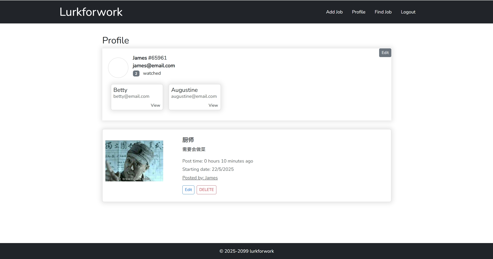
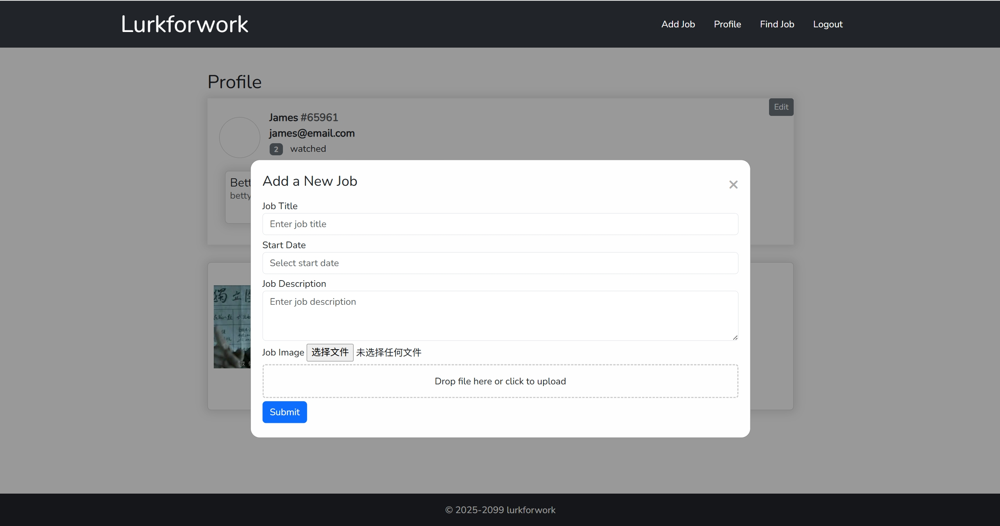
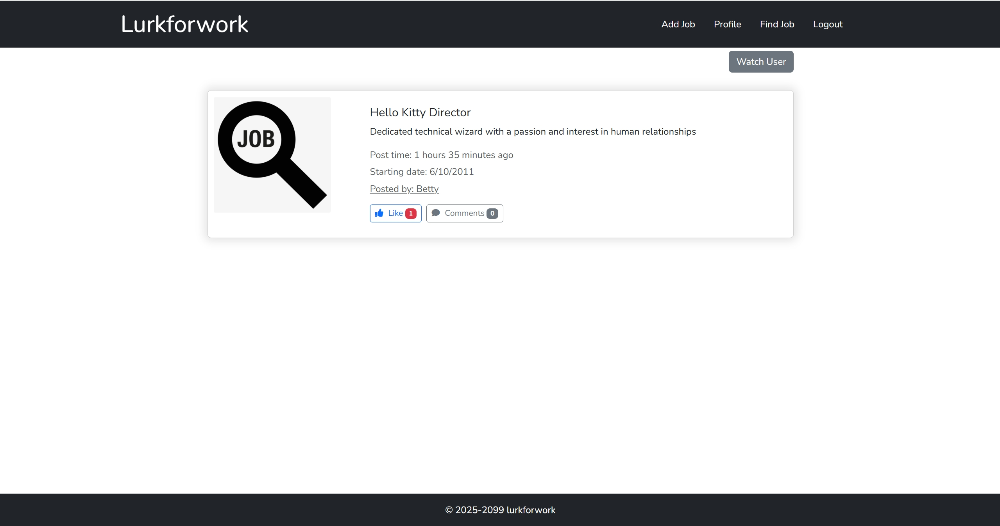

# LurkForWork - 求职社交平台

## 项目简介
LurkForWork 是一个仿 LinkedIn 的简易求职社交平台，前端采用原生 JavaScript 实现，没有使用任何前端框架，后端基于 Node.js + Express。用户可以注册、登录、发布和管理职位信息，浏览他人资料，进行点赞、评论、关注等社交操作。

---

## 项目界面预览

### 1. 首页与登录/注册

- 未登录时，用户可选择注册或登录。
- 登录后进入主页面。

---

### 2. 个人资料页

- 显示用户基本信息、被关注列表。
- 可查看和管理自己发布的职位。
- 支持编辑个人信息。

---

### 3. 发布职位

- 通过弹窗表单填写职位标题、开始日期、描述和图片，轻松发布新职位。

---

### 4. 找工作页面

- 浏览所有关注用户发布的职位信息。
- 支持点赞、评论、查看职位详情和职位发布者信息。

---

## 主要功能
- 用户注册、登录、登出
- 个人资料查看与编辑
- 发布、编辑、删除职位
- 职位点赞、评论
- 关注/取关其他用户
- 无限滚动加载、实时更新、推送通知（可选进阶）
- 离线访问支持（可选进阶）

---

## 项目结构
```
lurkforwork/
├── frontend/          # 前端代码
├── backend/           # 后端代码
├── util/              # 工具脚本
└── README.md          # 项目说明文档
```

---

## 启动与运行

1. **克隆项目**
   ```bash
   git clone <你的仓库地址>
   cd lurkforwork
   ```

2. **初始化设置**
   > Windows 用户可直接运行 `util/setup.sh`，如遇问题请手动检查依赖。
   ```bash
   ./util/setup.sh
   ```

3. **安装依赖**
   - 进入 `backend` 目录，安装后端依赖：
     ```bash
     cd backend
     npm install
     ```

4. **启动后端服务**
   ```bash
   npm run start
   ```
   后端默认监听本地端口（如有变动请参考 backend 目录下说明）。

5. **启动前端页面**
   - 进入 `frontend` 目录，使用本地服务器（如 VSCode Live Server 插件、http-server、python simple server 等）启动前端：
     ```bash
     cd ../frontend
     # 任选其一
     npx http-server .
     # 或
     python -m http.server 8080
     ```
   - 在浏览器中访问 `http://localhost:8080`（或你设置的端口）。

---

## API接口

### 认证相关
- POST /auth/login - 用户登录
- POST /auth/register - 用户注册

### 工作相关
- GET /job/feed - 获取工作信息流
- POST /job - 发布新工作
- PUT /job - 更新工作信息
- DELETE /job - 删除工作
- POST /job/comment - 发表评论
- PUT /job/like - 点赞工作

### 用户相关
- GET /user - 获取用户信息
- PUT /user - 更新用户信息
- PUT /user/watch - 关注/取消关注用户

---

## 开发说明
- 本项目使用原生JavaScript开发，无任何框架
- 前端代码位于frontend目录
- 后端代码位于backend目录
- 使用localStorage进行本地数据存储

## 注意事项
- 确保在开始开发前运行setup.sh脚本
- 所有API请求需要携带认证token
- 图片上传支持base64格式

## 许可证
本项目采用 MIT 许可证。
